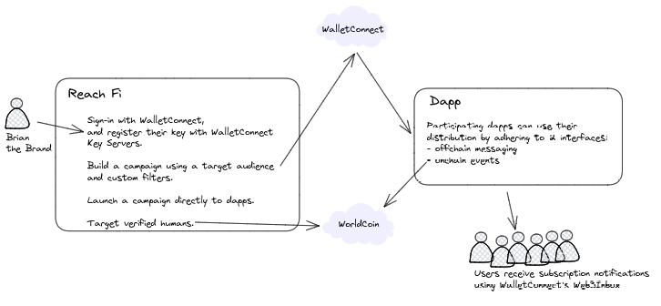
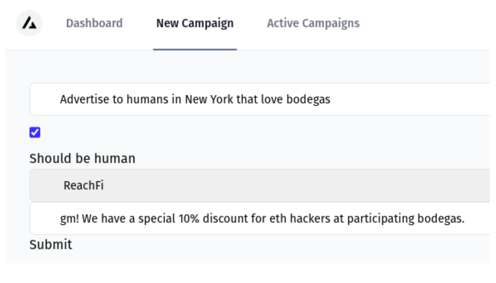
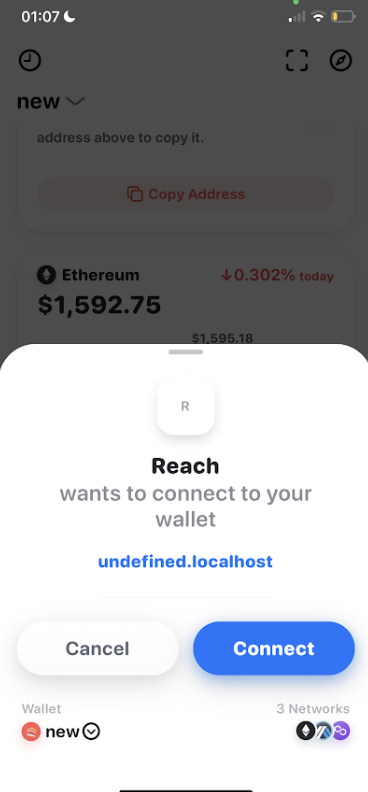
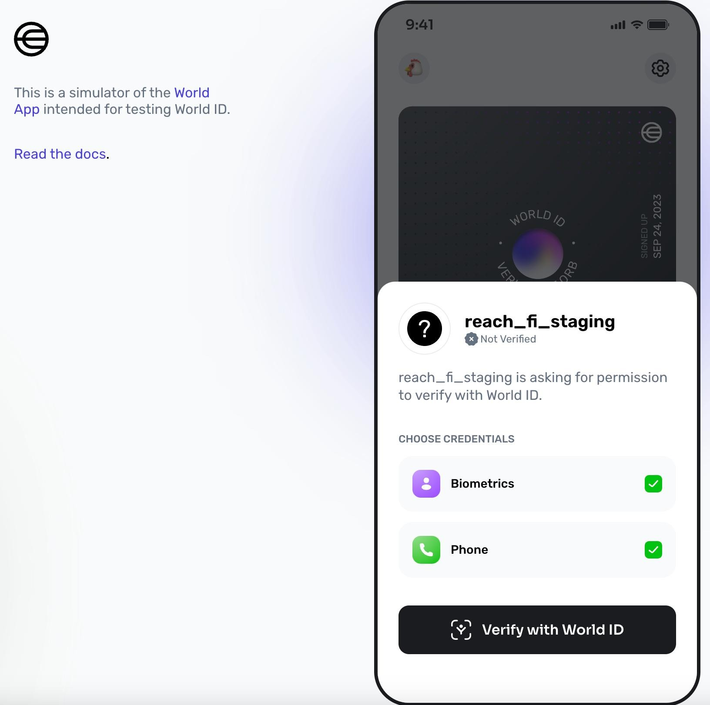
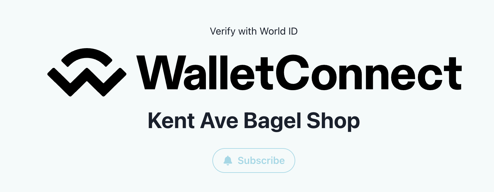

# Reach Fi

Verifiable Marketing Campaign Platform for the next millions of human users.

- Campaign Portal: https://reach-6932rzpsw-philipglazman.vercel.app/
- Kent Ave Bagel Shop (Example Dapp): Run locally, visit: http://localhost:3000/
- Deployed Worldcoin verify contract (see contracts/`ReachContract.sol`): https://goerli.basescan.org/address/0xDBc93E34bAf28d2f92FB931A44705b700B8820A2

```
# dev mode
pnpm i && pnpm dev

# build mode
pnpm run build
```

# Architecture



# Built with
- Worldcoin IDKit: https://docs.worldcoin.org/id/idkit
- WalletConnect Web3Inbox Docs - https://docs.walletconnect.com/2.0/web3inbox/core-components/usage
- QuickNode Base RPC: https://www.quicknode.com/docs/base
- Foundry (Deploy and debug): https://book.getfoundry.sh/forge/deploying
## Overview






- Dapps can participate in improving ad spend with two interfaces: an off-chain WalletConnect Web3Inbox SDK and an on-chain events emitted by WorldCoin
- Users can use their World ID to submit a proof to Dapps which call WorldCoin Router contracts. Successful execution emits on-chain EVM events allowing ReachFi to filter advertisement campaigns to humans only.
- Dapps receive brand marketing material with WalletConnect's Web3Inbox SDK. Brands can push out messages from ReachFi to Dapps, which can then forward the messages to users.


### Deploy the example dapp (Kent Ave Bagel Shop)

This section is taken from https://github.com/WalletConnect/gm-hackers as instructions how we deployed the example dapp. 

1. Head over [WalletConnect Cloud](https://cloud.walletconnect.com) and Sign in or Sign up if you don't have an account.
2. Create a project and take note of your Project ID.
3. Deploy your app to a public URL. Note you will need to set the `NEXT_PUBLIC_PROJECT_ID` environment variable to your Project ID from step #2. Some options to create your repo and deploy to a public URL include:
   - [Create repo & Deploy to Vercel](https://vercel.com/new/clone?repository-url=https%3A%2F%2Fgithub.com%2FWalletConnect%2Fgm-hackers&env=NEXT_PUBLIC_PROJECT_ID&envDescription=Get%20your%20Project%20ID%20on%20WalletConnect%20Cloud.&envLink=https%3A%2F%2Fcloud.walletconnect.com%2F)
   - [Create repo & Deploy to Netlify](https://app.netlify.com/start/deploy?repository=https://github.com/WalletConnect/gm-hackers)
   - Fork/clone this repo and deploy yourself
4. Back in the WalletConnect Cloud, navigate to your project's APIs tab. Under Notify API Step 1, provide your public URL as the dapp URL. Click Save.
5. Still on Notify API section, you should see a `Notify API Secret`. Copy this secret into your deployment as the `NOTIFY_API_SECRET` environment variable. Make sure to update the environment variables on your local environment as well as on your deployment platform.
6. Next, you will need to host the two files on this page at the `/.well-known/` directory of your public URL. You can do this by saving them to the `/public/.well-known/` directory of your fork of this template repo. Note that you will need to overwrite the two files that already exist.

   - Download `did.json` (Step 2: “Download did:web”) and place it at `/public/.well-known/did.json`
   - Download `wc-notify-config.json` (Step 3: “Download template”) to `/public/.well-known/wc-notify-config.json`
     - Update the `description` field in `wc-notify-config.json` to the description of your app.
   - Update your `NEXT_PUBLIC_APP_DOMAIN` environment variable to include the hostname of your deployment.
   - Deploy your changes in `/public/.well-known/` to your public URL (e.g. by committing and pushing).

7. Once the new files are deployed, on the APIs tab in Cloud, find the toggle switch next to the Notify API section and switch it on. You should see a success toast: "Notify configuration successfully verified"

### Managing environment variables

- [Vercel Environment variables](https://vercel.com/docs/projects/environment-variables)
- [Netlify Environment variables](https://docs.netlify.com/environment-variables/overview/)